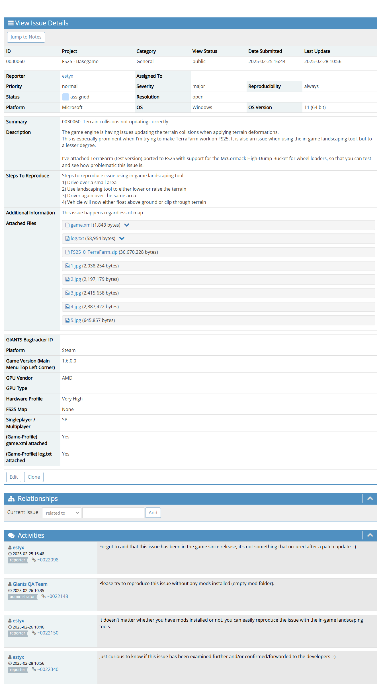
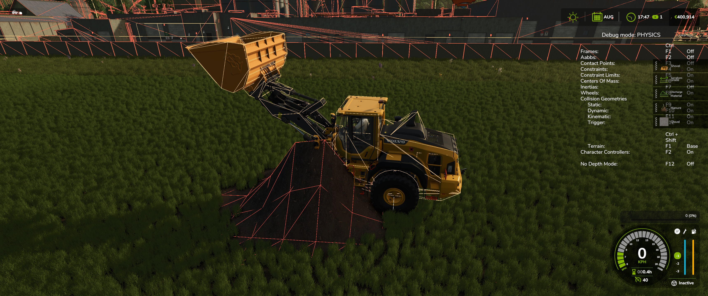
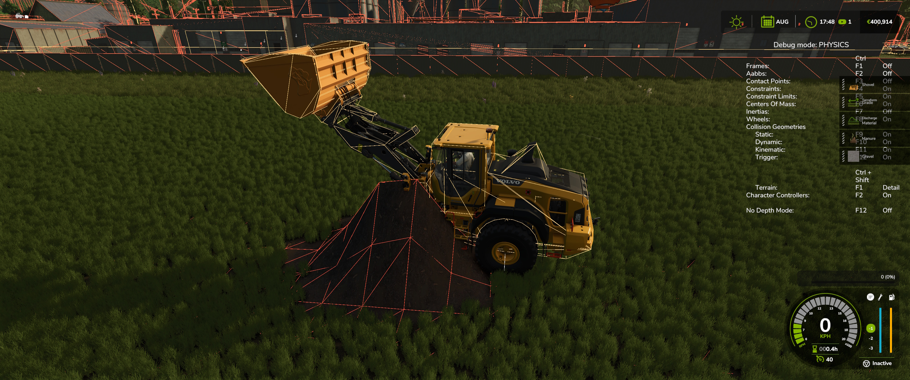
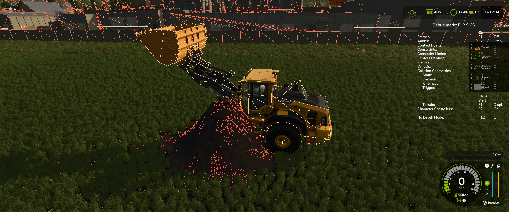
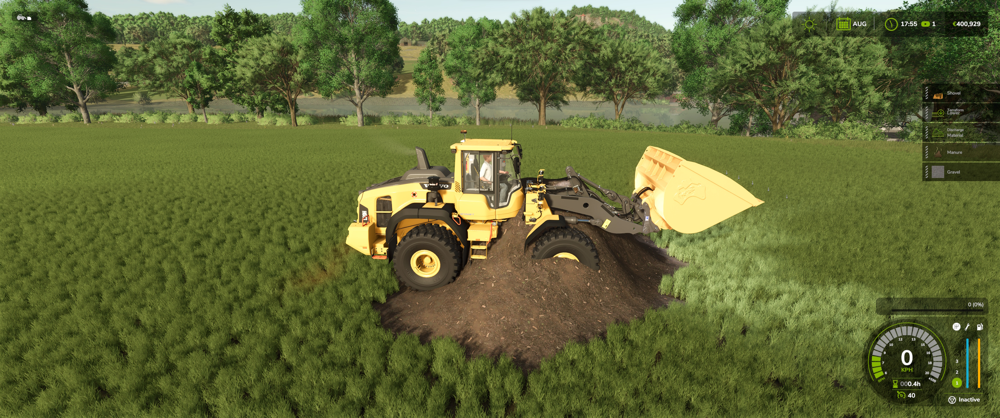
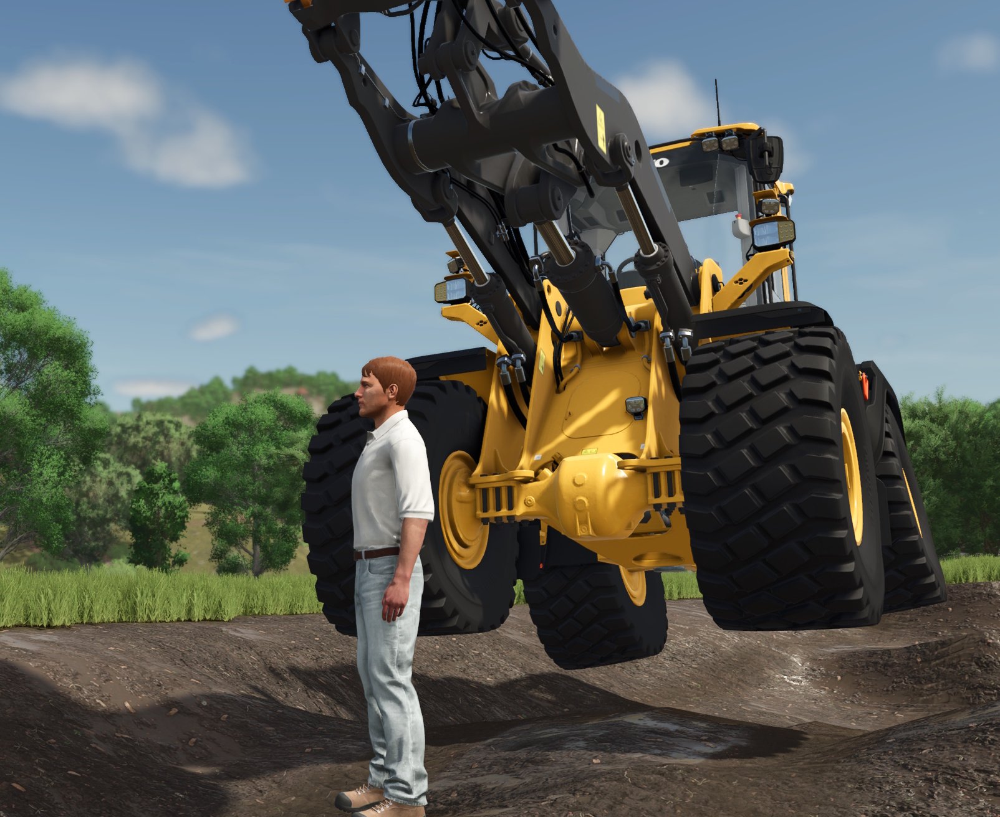

# TerraFarm FS25

## Status

95% completed.

Due to engine bug(s), the process of getting TerraFarm working properly in FS25 is stalled. The main issue is that the terrain collisions are not properly updated when deforming the terrain, resulting.

This has been reported to Giants (not only by me), but there has not been any feedback whether they are working on a fix or if it will ever be fixed.

So this is out of my hands, and TerraFarm will not be available at all for FS25 unless the terrain collisions issues are resolved.

## Bugtracker issue

## Referenced images

