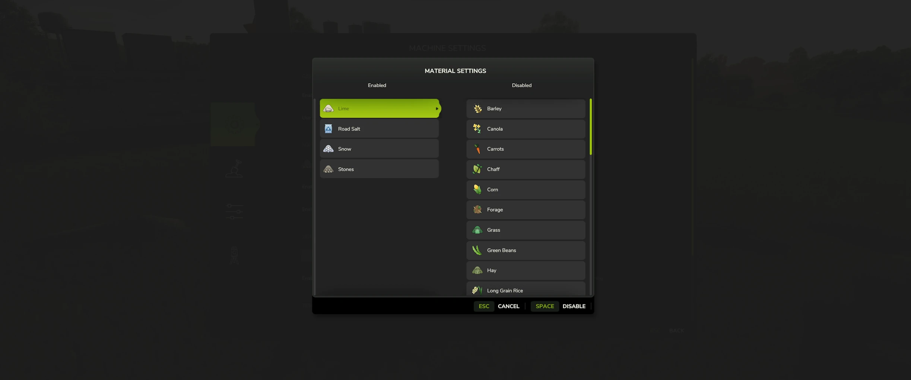
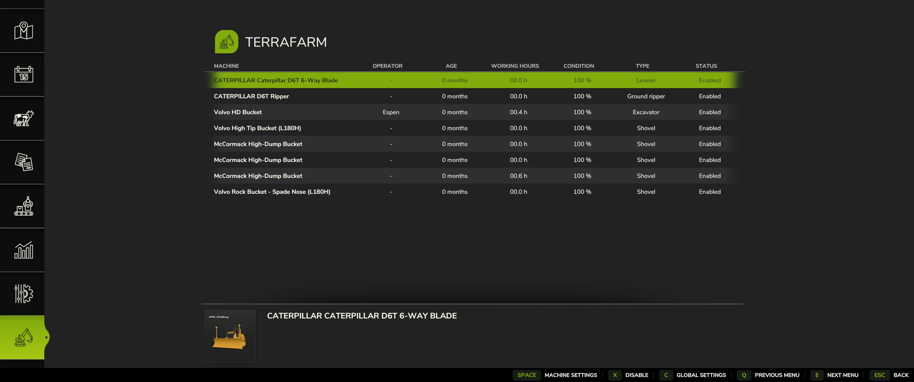
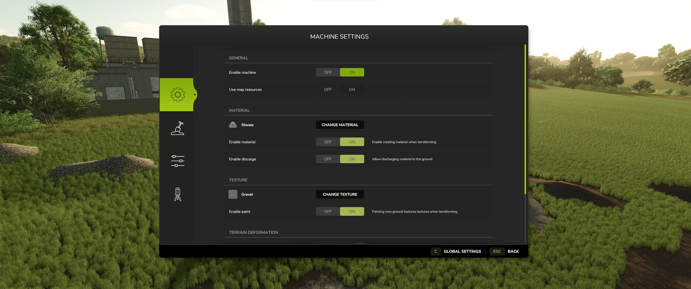
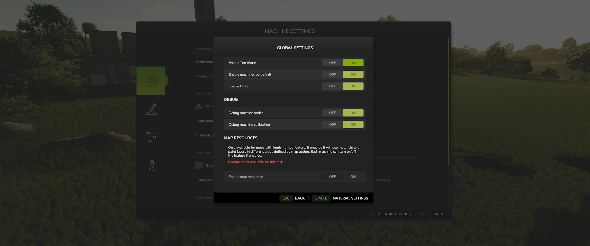

Tired of using the landscaping tool to carve out your land? Not satisfied with using fill types on the ground to supply your mining team? No worries, with TerraFarm you can shape your own land using the equipment of your choice.

[](https://ko-fi.com/scfmod) [](https://patreon.com/scfmod?)

# TerraFarm

```
author: scfmod
url:    https://github.com/scfmod/FS25_TerraFarm

DO NOT UPLOAD IT TO MONETARY UPLOAD SERVICES.
THIS CODE IS AVAILABLE TO ANYONE FOR FREE AND YOU CAN USE
IT TO LEARN, FORK AND SPREAD THE KNOWLEDGE.
```

## Table of Content

- [How to download and install](#how-to-download-and-install)
- [Download machine addons](#download-machine-addons)
- [Multiplayer](#multiplayer)
- [Materials](#materials)
- [Supported equipment](#supported-equipment)
  - [Base game](#base-game)
- [Surveyor](#surveyor)
- [Documentation](#documentation)
- [Map resources extension](#map-resources-extension)
- [How to report bugs](#how-to-report-bugs)
- [FAQ](#faq)
- [Known issues](#known-issues)
- [Translations](#translations)
- [Credits](#credits)
- [Screenshots](#screenshots)

## How to download and install

Download the latest [```FS25_0_TerraFarm.zip```](https://github.com/scfmod/FS25_TerraFarm/releases/latest/download/FS25_0_TerraFarm.zip) and copy/move it into your FS25 mods folder.

## Download machine addons

For supporting 3rd. party machine configurations

### [Official machines addon mod](https://github.com/scfmod/FS25_TerraFarmMachines)

Download the latest [```FS25_0_TerraFarmMachines.zip```](https://github.com/scfmod/FS25_TerraFarmMachines/releases/latest/download/FS25_0_TerraFarmMachines.zip) and copy/move it into your FS25 mods folder.


## Multiplayer

Multiplayer is fully supported. In order to use machines, players will need to have either landscaping permission, be farm manager or granted admin access.
Farm managers can disable/enable machines owned by the farm, and admins can control global settings.

## Materials

All materials available on map, including mods adding filltypes, will be available for players to use.
There is also a material settings dialog where you can control which materials players can select (SP and MP).




## Supported equipment

TerraFarm integrates support for base game equipment and upcoming DLC equipment when applicable.

TerraFarm supports vehicle specialization for modders to integrate configuration(s) directly into their mods as well as addon mods with configurations.

### Base game
```
- Albutt front loader bucket
- Holaras MES 400 leveler
- Magsi telehandler bucket
- Magsi wheel loader bucket
- mcCormack overtipping bucket
- Paladin high dump bucket
- Prinoth Leitwolf Agripower
- Volvo L120H general purpose bucket
- Volvo L120H high tip bucket
- Volvo L120H rock bucket
- Volvo L180H general purpose bucket
- Volvo L180H high tip bucket
- Volvo L180H rock bucket
```

## Surveyor

A feature in TerraFarm is the option to use surveyor equipment to calibrate your machine(s). This allows you to level at a specific height or grade at a certain angle following the calibrated line.


If you want to create your own surveyor equipment, read more [here](./docs/SURVEYOR.md).

## Documentation

For implementing vehicle configurations and creating configuration mods see [``INDEX.md``](/docs/INDEX.md)

## Map resources extension

Feature for map makers to define areas on map with resources. When a compatible map is loaded an extra option will be enabled in TerraFarm global settings dialog.

For more information on integrating into map see [``MAP_RESOURCES.md``](/docs/MAP_RESOURCES.md)

## How to report bugs

Before reporting a bug please do the following:
- Make sure you are using the [latest version](#download) downloaded from the official GitHub repository.
- Make sure there aren't any issues previously filed for the same bug.
- Disable all other mods to make sure it's not a conflict/another mod causing the issue.
- Be able to reproduce the bug.
- If it's not a map specific bug, please use one of the base game maps.

Create a new issue on [this page](https://github.com/scfmod/FS25_TerraFarm/issues/).
If applicable, attach log.txt or use https://pastebin.com and include the link in the issue.
In the text please describe what the bug is and how to reproduce it.

**NOTE: A (huge) log.txt filled with unrelated warnings/errors from other mods will be rejected.**

## FAQ

#### Console support (XBOX/PS)?
No, script mods are not available on consoles.

#### Does this mod add any filltypes?
No.

## Known issues

On client side in multiplayer tire tracks doesn't disappear when terraforming the landscape.
This is because the game does not sync tire tracks in multiplayer. I may be able to fix this in a later version, but for now this is a very low prioritized visual bug.

Please note that terrain deformations are still a work in progress, so more adjustments will be worked on in the future.

## Translations

If anyone is interested in adding more translations to the mod, [create a new issue](https://github.com/scfmod/FS25_TerraFarm/issues/) with translation file(s) and I will add them :-)


# Credits

Huge thanks to PeteyJ for creating the PSV2 Surveyor shipped with this mod.

Also a big thanks to the fellow modders from **Jeremy Brown Modeling and Simulation** and **WZL Modding** discord servers for all the testing and feedback on the FS22 version.

[](https://github.com/open-modding-alliance)

Also be sure to follow and support the [Open Modding Alliance](https://github.com/open-modding-alliance) if you're a modder or interested in creating mods for FS22/FS25.

## Screenshots

Ingame menu


Machine settings


Global settings
